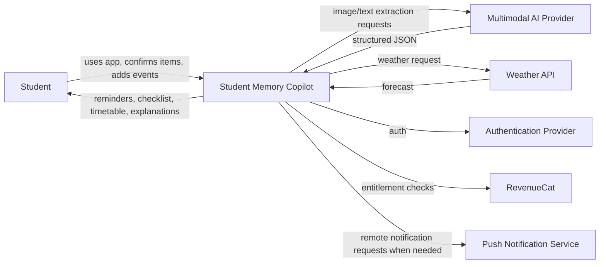
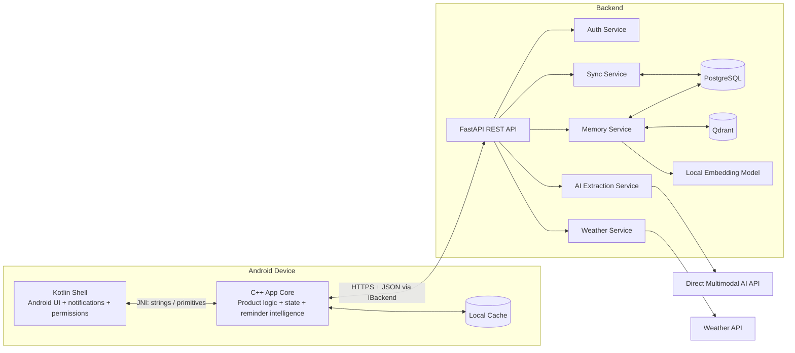
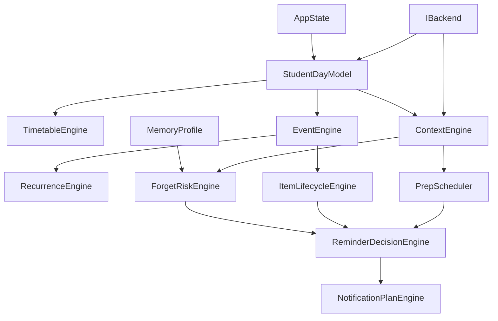

# Student Memory Copilot — BUILD.md

> **Product:** Student Memory Copilot  
> **Tagline:** Bring it. Do it. Bring it back.  
> **Primary target:** Android  
> **Architecture:** Thin Kotlin shell + platform-blind C++ core + REST backend + relational DB + vector DB  
> **AI approach:** Direct model API calls only. No LangChain, LlamaIndex, agent framework, or AI wrapper.

---

## 1. Product Goal

Build a university-focused reminder and memory app for students who are forgetful and do not want to manually manage a complicated planner.

The app should answer three questions throughout the day:

1. **BRING** — What do I need for my next class or event?
2. **DO** — What must I complete or prepare before it?
3. **BRING BACK** — What did I bring that must leave with me?

The app should gradually learn which items and situations the user is most likely to forget and adjust reminder priority and timing accordingly.

This is **not** a generic to-do app, calendar clone, LMS clone, or chatbot.

The main product idea is:

> Most reminder apps remember what the user remembered to enter. This app learns what the student tends to forget.

---

## 2. Non-Negotiable Architecture Rules

These rules must be respected throughout the project.

### 2.1 C++ is the product brain

The majority of product logic belongs in the C++ core.

C++ owns:

- app state
- timetable logic
- event recurrence
- item lifecycle
- Bring / Do / Bring Back logic
- reminder decision logic
- forget-risk scoring
- reminder priority
- preparation scheduling
- context evaluation
- user memory profile
- local decision rules
- serialization models
- data-driven configuration
- custom rendering / visual state where applicable

### 2.2 Kotlin is a thin Android shell

Kotlin owns Android-specific concerns only:

- Activity / Fragment lifecycle
- Android permissions
- notification channels
- local notifications
- AlarmManager / WorkManager
- camera / gallery / file picker
- keyboard and text input
- Android lifecycle events
- network availability callbacks
- RevenueCat Android SDK
- JNI bridge

Kotlin must **not** duplicate C++ business rules.

Do not implement reminder scoring, recurrence, item lifecycle, prep scheduling, forget logic, or context reasoning in Kotlin.

### 2.3 JNI boundary stays simple

Only pass simple values across JNI:

- integers
- floats / doubles
- booleans
- strings
- byte arrays
- arrays of primitive values
- serialized JSON strings where appropriate

Never pass:

- raw C++ pointers
- `std::vector` objects
- C++ class instances
- references to C++ memory owned across the boundary

Do not throw C++ exceptions across JNI.

### 2.4 Networking is isolated

All network access must be hidden behind `services/` interfaces.

The rest of the C++ core must not know whether data came from:

- the real backend
- a fake backend
- local cache
- a test fixture

Create `IBackend` first.

Create `FakeBackend` before the real backend.

### 2.5 Offline-first

The app must still support these features without internet:

- timetable viewing
- manual event creation
- Bring checklist
- Do / preparation view
- Bring Back checks
- recurrence
- forget-risk calculation
- local reminder decisions
- local notifications
- item lifecycle

Online-only features may gracefully degrade:

- AI screenshot extraction
- semantic memory search
- fresh weather
- account sync

The app must never become unusable because the backend is down.

---

## 3. Recommended Cost-Efficient Tech Stack

| Layer | Technology | Purpose |
|---|---|---|
| Mobile platform | Android | Primary app target |
| Platform shell | Kotlin | Android APIs only |
| Native core | C++20/23 | Main product logic |
| Android ↔ C++ | JNI | Thin bridge |
| Build | CMake + Gradle | CMake owns C++ project definition |
| Rendering | SDL + OpenGL ES 3.0 | Native visual layer where required |
| Backend | Python + FastAPI | Lightweight REST backend |
| Transport | HTTPS + JSON | Simple service boundary |
| Structured DB | PostgreSQL | Users, events, tasks, items, history |
| Dev structured DB | SQLite optional | Cheap local development |
| Vector DB | Qdrant | Semantic memory retrieval |
| Embeddings | Local sentence-transformer | Avoid per-request embedding cost |
| Multimodal AI | Direct low-cost multimodal model API | Screenshot / message extraction |
| Weather | Open-Meteo or equivalent | Context data |
| Auth | Firebase Auth or equivalent | Avoid custom auth implementation |
| Push | FCM where server push is needed | Remote push |
| Local reminders | AlarmManager / WorkManager | Reliable device reminders |
| Subscription | RevenueCat | Shipaton monetisation |
| CI | GitHub Actions | Build / test / lint |

### 3.1 AI provider policy

Do not hard-code the AI vendor into the domain layer.

Create a small backend interface:

```text
IAiExtractionProvider
  ├── ExtractTimetable(image/text)
  └── ExtractInstruction(image/text)
```

Implement exactly one real provider first.

Use direct HTTPS or the provider's official SDK.

Do not introduce:

- LangChain
- LlamaIndex
- AutoGen
- LangGraph
- agent frameworks
- RAG wrappers

The app does not need them.

### 3.2 Embedding policy

Use a local backend embedding model first, for example a small sentence-transformer.

Flow:

```text
text
  ↓
local embedding model
  ↓
vector
  ↓
Qdrant
```

Benefits:

- no embedding API bill
- predictable latency
- no wrapper dependency
- easier technical explanation

---

## 4. C4-Style Architecture

### 4.1 System Context



### 4.2 Container Diagram



### 4.3 C++ Core Components



---

## 5. Core Product Features

### 5.1 Timetable screenshot import

User uploads a timetable screenshot.

Backend sends the image to the multimodal AI provider once.

Expected structured output:

```json
{
  "events": [
    {
      "course_code": "CSD2183",
      "course_name": "Data Structures",
      "day": "Monday",
      "start_time": "13:00",
      "end_time": "15:00",
      "location": "Room 4-2",
      "event_type": "tutorial"
    }
  ]
}
```

Rules:

- validate the JSON against a strict schema
- show the extracted timetable to the user
- require user confirmation before saving
- never silently trust extraction
- cache results by content hash
- never call AI again just to render the timetable

### 5.2 Manual events

Users can manually create:

- lectures
- tutorials
- labs
- gym
- swimming
- club activities
- meetings
- tests
- examinations
- assignment deadlines
- submission deadlines
- personal events

Fields:

- id
- title
- course/module
- event type
- date
- start time
- end time
- location
- recurrence rule
- required items
- preparation tasks
- notes

### 5.3 Required items

Users can attach required items to an event.

Examples:

```text
Programming Lab
- Laptop
- Charger

Math Tutorial
- Calculator

Swimming
- Goggles
- Towel
- Change of clothes
```

An association can be:

- one-time
- recurring for this event/class

Once confirmed, recurring associations must be stored as structured data and must not require AI again.

### 5.4 Bring reminders

Before an event, show:

```text
PROGRAMMING LAB
14:00 · Room 3-5

Bring:
- Laptop
- Charger

[PACKED] [REMIND LATER] [NOT NEEDED TODAY]
```

### 5.5 Pre-event navigation reminder

Shortly before an event:

```text
NEXT
CSD2183 Tutorial
13:00
Room 4-2

Bring:
- Calculator
```

### 5.6 Bring Back

Before an event ends:

```text
BEFORE YOU GO

You brought:
- Laptop
- Charger
- Water bottle

Everything with you?
```

Only include items relevant to the current item lifecycle.

Do not show every item the user owns.

### 5.7 Recurring preferences

Example:

> Calculator is required for Math every week.

Store this as a recurring event-item association.

Do not ask the user every week.

The user must also be able to choose:

> only for this occurrence

### 5.8 Lecturer / announcement extraction

Input:

> Next Wednesday please complete Questions 1–8 and bring your scientific calculator.

AI output:

```json
{
  "related_event": "Math Tutorial",
  "date": "2026-10-07",
  "required_items": ["Scientific calculator"],
  "tasks": [
    {
      "title": "Complete Questions 1-8",
      "must_complete_before_event": true
    }
  ]
}
```

Require confirmation before saving.

### 5.9 Preparation / DO

Each event may contain work that should be completed before it.

Example:

```text
Operating Systems Tutorial
Monday 19:00

Tutorial 4
Estimated duration: 60 minutes
```

`PrepScheduler` should inspect:

- event start
- deadline
- estimated duration
- known timetable
- free windows
- other important tasks

Then suggest a feasible preparation window.

This is deterministic C++ scheduling, not an LLM call.

### 5.10 Weather context

Example rule:

```text
rain_probability >= configured_threshold
AND user is expected to travel
→ suggest umbrella
```

Do not use AI for simple weather decisions.

---

## 6. Item Lifecycle

Implement `ItemLifecycleEngine` in C++.

Allowed states:

```text
NEEDED
  ↓
PACKED
  ↓
BROUGHT
  ↓
IN_USE
  ↓
NEEDS_TO_RETURN
  ↓
SAFE
```

Failure state:

```text
FORGOTTEN
```

Rules:

- state transitions must be explicit
- invalid transitions must be rejected
- transition logic must be unit tested
- lifecycle state must survive app restart

Example:

```text
07:30 Charger → PACKED
13:50 Charger → BROUGHT
14:00 Charger → IN_USE
15:50 Charger → NEEDS_TO_RETURN
16:00 Charger → SAFE
```

If user taps `Forgot`:

```text
Charger → FORGOTTEN
ForgetProfile.Update(...)
```

---

## 7. Forget Profile

Track structured history.

Example model:

```text
ItemForgetStats
- item_id
- course_id
- event_type
- forget_count
- successful_return_count
- ignored_reminder_count
- successful_reminder_count
- last_forgotten_at
- last_success_at
```

### 7.1 Initial risk formula

Use a deterministic explainable score.

```text
risk =
    0.30 * normalized_forget_frequency
  + 0.25 * event_association
  + 0.20 * item_importance
  + 0.15 * unusualness
  + 0.10 * urgency
```

Weights must live in config data, for example:

`data/reminder_weights.json`

```json
{
  "forget_frequency_weight": 0.30,
  "event_association_weight": 0.25,
  "importance_weight": 0.20,
  "unusualness_weight": 0.15,
  "urgency_weight": 0.10
}
```

Do not scatter magic numbers across code.

---

## 8. Reminder Decision Engine

`ReminderDecisionEngine` decides:

- what should be shown
- whether the user should be interrupted
- when the reminder should fire
- how strong the reminder should be

Suggested levels:

```text
LOW
→ checklist only

MEDIUM
→ highlight in app

HIGH
→ local push notification

VERY HIGH
→ persistent / high-priority reminder where supported
```

Design principle:

> Right thing. Right moment. Right intensity.

Do not send repeated identical notifications.

Bundle reminders where sensible.

---

## 9. Adaptive Reminder Timing

Do not use reinforcement learning in the MVP.

Use simple observable response statistics.

Suggested timing buckets:

```text
>120 min before
60–120 min
30–60 min
15–30 min
<15 min
```

Track actions:

- ignored
- opened
- packed
- remind later
- completed
- forgotten

Example:

```text
120 min: ignored
60 min: ignored
20 min: packed
```

Over sufficient history, prefer the timing window with a stronger successful-action rate while still giving the student enough time to act.

Make the algorithm deterministic and testable.

---

## 10. AI Responsibilities

AI should answer:

> What does this messy human input mean?

C++ should answer:

> What should the app do about it?

### 10.1 Real AI capability #1 — Multimodal structured extraction

Use direct API calls for:

- timetable screenshot extraction
- lecturer screenshot extraction
- lecturer text/message extraction

Use strict structured JSON.

### 10.2 Real AI capability #2 — Semantic embeddings

Prefer a local embedding model on the backend.

Use embeddings for:

- lecturer announcements
- student notes
- natural-language instructions
- semantic memory retrieval

Do not use embeddings for:

- `packed=true`
- class time
- deadline timestamps
- reminder settings
- forget counts

Those belong in PostgreSQL / structured storage.

---

## 11. Vector Memory

Use Qdrant for semantic memory.

### 11.1 What goes into Qdrant

- lecturer announcements
- student notes
- class instructions
- one-off natural-language requirements
- historical natural-language context

Payload example:

```json
{
  "user_id": "user-123",
  "course_id": "CSD2183",
  "event_id": "event-456",
  "memory_type": "lecturer_announcement",
  "source": "uploaded_screenshot",
  "created_at": "2026-09-26T12:00:00Z",
  "text": "Bring your Arduino board and USB-C adapter next lab."
}
```

Every query must filter by `user_id`.

Never retrieve memories across users.

### 11.2 Retrieval flow

```text
user question
    ↓
local embedding model
    ↓
query vector
    ↓
Qdrant search
    ↓
metadata filter: user / course / date
    ↓
top 3–5 relevant memories
    ↓
optional LLM synthesis
    ↓
answer
```

Vector search itself must not invoke an LLM.

---

## 12. Cost-Efficient AI Rules

These are mandatory.

1. Never call an LLM for deterministic business logic.
2. Cache timetable extraction by image/text content hash.
3. Cache lecturer-message extraction by content hash.
4. Generate embeddings only when a memory is created or materially edited.
5. Do not regenerate embeddings on every query.
6. Vector search does not require an LLM call.
7. Retrieve only top 3–5 memories by default.
8. Keep prompts short and task-specific.
9. Require structured output for extraction.
10. Validate extraction output before storage.
11. Retry failed AI parsing at most once.
12. Fall back to manual entry after failure.
13. Default development mode uses fake AI.
14. Weather never uses AI.
15. Risk scoring never uses AI.
16. Reminder scheduling never uses AI.
17. Item lifecycle never uses AI.
18. Notification wording should use local templates, not generation calls.

---

## 13. Backend API

Version all endpoints.

Base:

```text
/api/v1
```

Suggested endpoints:

```text
POST /api/v1/ai/timetable/extract
POST /api/v1/ai/instruction/extract

POST /api/v1/memory
POST /api/v1/memory/search
DELETE /api/v1/memory/{id}

GET  /api/v1/weather

GET  /api/v1/events
POST /api/v1/events
PUT  /api/v1/events/{id}
DELETE /api/v1/events/{id}

POST /api/v1/forget-events

POST /api/v1/sync
```

Requirements:

- request validation
- authentication where required
- explicit error response model
- timeout handling
- rate limiting on paid AI endpoints
- structured logging
- no secrets returned to client

---

## 14. Structured Database

Suggested PostgreSQL tables:

```text
users
courses
events
items
event_items
tasks
reminder_preferences
reminder_history
forget_events
memory_metadata
ai_cache
```

Important indexes:

```text
events(user_id, start_time)
event_items(event_id)
tasks(user_id, deadline)
forget_events(user_id, item_id, event_id)
ai_cache(content_hash)
```

### 14.1 Rule of thumb

```text
PostgreSQL = what is true
Qdrant     = what may be relevant
```

---

## 15. Clean C++ Code Standards

Code quality is a first-class requirement.

### 15.1 General

- prefer small cohesive classes
- one clear responsibility per class
- avoid god objects
- avoid long functions
- keep domain logic independent from Android
- prefer composition over inheritance
- prefer value types where possible
- use RAII everywhere
- follow Rule of Zero where possible
- avoid raw `new` / `delete`
- use smart pointers only when ownership requires them
- use references for required non-owning dependencies
- use pointers only when null is meaningful
- use `const` aggressively
- prefer `enum class` over plain enums
- avoid hidden global mutable state
- avoid singletons for domain logic
- avoid macros for normal program logic
- avoid magic numbers
- avoid platform `#ifdef` inside domain systems

### 15.2 Naming

Suggested convention:

```text
Types / classes:      PascalCase
Functions:            PascalCase or project-agreed style
Local variables:      camelCase
Private members:      mCamelCase
Constants:            kPascalCase
Namespaces:           lowercase
Files:                match primary type
```

Use one convention consistently.

### 15.3 Headers

- minimize includes
- use forward declarations where appropriate
- never put unrelated implementation into headers
- keep public interfaces small
- avoid circular dependencies

### 15.4 Error handling

Expected recoverable failures must be explicit.

Examples:

- backend timeout
- malformed JSON
- AI extraction failure
- missing event
- invalid item transition
- network offline

Do not silently swallow errors.

Do not use exceptions across JNI.

### 15.5 Comments

Comments should explain **why**, not restate the code.

Bad:

```cpp
// Increase count
count++;
```

Good:

```cpp
// A forgotten item increases the event-specific risk history so future
// reminders can be promoted without affecting unrelated classes.
forgetCount++;
```

---

## 16. Clean Backend Code Standards

Backend code should remain thin and explicit.

Use layers such as:

```text
route
  ↓
service
  ↓
repository / provider
```

Do not put SQL, AI calls, and request parsing inside one route function.

Example:

```text
POST /ai/timetable/extract
    ↓
TimetableExtractionService
    ↓
IAiExtractionProvider
    ↓
DirectModelProvider
```

Use Pydantic models for request / response validation.

Keep provider-specific code isolated.

---

## 17. Repository Layout

```text
project/
│
├── source/
│   ├── app/
│   │   └── composition / wiring
│   │
│   ├── core/
│   │   ├── Event.hpp
│   │   ├── Item.hpp
│   │   ├── Task.hpp
│   │   ├── Reminder.hpp
│   │   └── StudentDay.hpp
│   │
│   ├── sim/
│   │   ├── TimetableEngine.*
│   │   ├── EventEngine.*
│   │   ├── RecurrenceEngine.*
│   │   ├── ItemLifecycleEngine.*
│   │   ├── ContextEngine.*
│   │   ├── MemoryProfile.*
│   │   ├── ForgetRiskEngine.*
│   │   ├── ReminderDecisionEngine.*
│   │   ├── PrepScheduler.*
│   │   └── NotificationPlanEngine.*
│   │
│   ├── services/
│   │   ├── IBackend.hpp
│   │   ├── FakeBackend.*
│   │   └── BackendClient.*
│   │
│   ├── render/
│   └── ui/
│
├── platform/
│   └── android/
│       ├── kotlin/
│       ├── jni/
│       ├── notifications/
│       ├── camera/
│       └── permissions/
│
├── backend/
│   ├── api/
│   ├── auth/
│   ├── ai/
│   │   ├── provider.py
│   │   ├── direct_model_provider.py
│   │   └── schemas.py
│   ├── memory/
│   │   ├── embedding_service.py
│   │   └── qdrant_repository.py
│   ├── database/
│   ├── weather/
│   └── sync/
│
├── data/
│   ├── reminder_weights.json
│   ├── reminder_templates.json
│   ├── event_templates.json
│   └── item_templates.json
│
├── tests/
├── cmake/
├── tools/
├── docker-compose.yml
└── CMakeLists.txt
```

---

## 18. Development Modes

Support exactly three modes.

### MOCK

Default development mode.

Uses:

- `FakeBackend`
- fake AI extraction
- fake weather
- fake semantic memory

Cost: essentially zero.

### LOCAL

Uses:

- FastAPI localhost
- PostgreSQL or SQLite
- Qdrant in Docker
- local embedding model
- optional real AI extraction

### PRODUCTION

Uses:

- hosted backend
- PostgreSQL
- Qdrant
- direct real AI API
- weather API
- Firebase / auth
- RevenueCat

---

## 19. Docker Compose

Local development should be startable with:

```bash
docker compose up
```

Include at minimum:

- backend
- PostgreSQL
- Qdrant

Do not require the Android client to run inside Docker.

---

## 20. Testing Requirements

Unit test the C++ core heavily.

Required tests:

- recurrence generation
- timetable ordering
- event overlap handling
- item lifecycle valid transitions
- item lifecycle invalid transitions
- forget score calculations
- risk threshold mapping
- reminder prioritisation
- reminder bundling
- prep scheduling
- adaptive timing buckets
- JSON serialization
- offline backend failure
- fake backend behaviour

Backend tests:

- AI schema validation
- cached extraction
- failed AI response
- vector upsert
- user-scoped vector search
- deletion
- weather timeout
- auth rejection

No test should require paid AI access by default.

---

## 21. CI / Code Quality Gates

Every pull request should run:

```text
C++ configure
C++ build
C++ tests
clang-format check
clang-tidy
backend unit tests
backend type / lint checks
```

Recommended rules:

- warnings as errors for first-party C++
- dependency versions pinned
- no commits directly to main
- branch per task
- PR review before merge
- secrets forbidden from repository

---

## 22. Security and Privacy

- never ship AI API keys in Android
- never commit API keys
- backend secrets come from environment variables
- vector search always filters by authenticated user id
- validate file uploads
- restrict upload size
- restrict accepted MIME types
- strip unnecessary metadata
- avoid retaining raw screenshots longer than needed
- allow user deletion of stored memories
- use HTTPS in production
- do not log raw private user content unless necessary

---

## 23. RevenueCat

RevenueCat is integrated in Kotlin because it is platform-specific.

Suggested product split:

### Free

- timetable
- manual events
- Bring
- Do
- Bring Back
- recurring required items
- basic weather context
- basic reminders
- basic forget tracking

### Pro

- AI timetable screenshot extraction
- AI lecturer-message extraction
- adaptive reminder timing
- advanced Forget Profile insights
- semantic student memory
- richer context integrations

Positioning:

> Free remembers your day. Pro learns how you forget.

Do not build custom payment infrastructure.

---

## 24. Reminder Message Templates

Do not spend AI calls generating routine reminder text.

Store templates locally.

Modes:

```text
NORMAL
FRIENDLY
AGGRESSIVE
```

Examples:

```text
NORMAL
Remember your charger before leaving the lab.

FRIENDLY
Quick charger check before you go 👀

AGGRESSIVE
DON'T LEAVE YET. WHERE IS YOUR CHARGER?
```

---

## 25. “Why Am I Seeing This?”

Every high-priority reminder should be explainable from known factors.

Example:

```text
Charger — HIGH RISK

Why?
- Required for Programming Lab
- You marked it packed this morning
- You forgot it after this class twice
- This class ends in 12 minutes
```

Prefer deterministic explanation generation.

Do not call an LLM unless a natural-language summary is genuinely useful.

---

## 26. Home Screen UX

Do not build a cluttered dashboard.

The screen should change with the user's current context.

### Morning

```text
BRING

Programming Lab · 14:00

⚠ Charger
  Laptop
  Calculator
☔ Umbrella

[I'M PACKED]
```

### Before class

```text
NEXT

CSD2183 Tutorial
13:00 · Room 4-2

Bring
- Calculator

Do
- Tutorial 4
```

### Near class end

```text
BRING BACK

- Laptop
- Charger
- Bottle

[EVERYTHING'S WITH ME]
```

Complexity belongs behind the UI, not in front of the user.

---

## 27. Implementation Order

Do not attempt everything at once.

### Phase 1 — Domain model

Build:

- Event
- Item
- Task
- StudentDay
- Reminder

Add tests.

### Phase 2 — C++ timetable and recurrence

Build:

- `TimetableEngine`
- `EventEngine`
- `RecurrenceEngine`

Add tests.

### Phase 3 — Item lifecycle

Build:

- `ItemLifecycleEngine`
- Bring
- Bring Back

Add tests.

### Phase 4 — Reminder planning

Build:

- `ForgetRiskEngine`
- `ReminderDecisionEngine`
- `NotificationPlanEngine`

Add tests.

### Phase 5 — Kotlin + JNI

Build thin Android shell.

Do not move business logic into Kotlin for convenience.

### Phase 6 — Local notifications

Integrate Android notification scheduling using C++-generated plans.

### Phase 7 — Manual event UI

Create / edit / delete events and items.

### Phase 8 — Forget profile

Persist user history and calculate risk.

### Phase 9 — Prep scheduler

Implement deterministic preparation scheduling.

### Phase 10 — Backend boundary

Implement:

- `IBackend`
- `FakeBackend`
- `BackendClient`

### Phase 11 — Real backend

FastAPI + PostgreSQL.

### Phase 12 — AI timetable extraction

Direct multimodal API only.

### Phase 13 — AI instruction extraction

Direct multimodal/text API only.

### Phase 14 — Vector memory

Local embedding model + Qdrant.

### Phase 15 — Weather

Add context integration.

### Phase 16 — RevenueCat

Add entitlement flow.

### Phase 17 — Polish

- onboarding
- animations
- accessibility
- empty states
- error states
- demo flow

---

## 28. MVP End-to-End Acceptance Flow

The build is not considered complete until this works end-to-end:

1. User opens the Android app.
2. User uploads a timetable screenshot.
3. AI extracts classes.
4. User confirms extracted classes.
5. User adds laptop and charger to Programming Lab.
6. User marks calculator as recurring for Math.
7. Weather context adds umbrella when appropriate.
8. Morning screen shows Bring checklist.
9. User marks charger packed.
10. Before class, app shows class, room, and required items.
11. Near class end, app asks for Bring Back items.
12. User marks charger as forgotten.
13. Forget Profile updates.
14. Next similar class gives charger a higher risk.
15. Reminder strength increases accordingly.
16. User pastes or uploads a lecturer instruction.
17. AI extracts Bring and Do information.
18. User confirms it.
19. PrepScheduler finds a reasonable preparation slot.
20. Lecturer instruction is stored as semantic memory if appropriate.
21. User asks what they need tomorrow.
22. Qdrant retrieves user-scoped relevant memory.
23. App returns the relevant answer without exposing unrelated data.

---

## 29. Definition of Clean Code for This Project

A change is not complete unless:

- it compiles without new warnings
- tests pass
- the feature lives in the correct layer
- no rule is duplicated across Kotlin and C++
- no network call leaks outside `services/`
- no secret is committed
- failure paths are handled
- names describe intent
- methods remain small and focused
- constants are configurable where appropriate
- public interfaces remain minimal
- unrelated files are not refactored without need

---

## 30. Instructions for Coding Agents

When implementing this repository:

1. Read this BUILD.md before changing code.
2. Inspect the existing architecture before creating new abstractions.
3. Do not rewrite working systems just to use a different style.
4. Do not introduce new frameworks unless the current architecture cannot solve the problem cleanly.
5. Do not add an AI wrapper framework.
6. Do not add an agent system.
7. Do not put business logic in Kotlin.
8. Do not call AI for deterministic decisions.
9. Do not create duplicate implementations in C++ and backend/Kotlin.
10. Implement the smallest complete vertical slice first.
11. Prefer explicit code over clever code.
12. Keep functions short and names descriptive.
13. Add tests with each new domain rule.
14. Run the relevant build and tests after each meaningful change.
15. Fix failing tests before moving to the next phase.
16. Never hide a failing real implementation behind fake success output.
17. Use mocks/fakes only in clearly identified development/test modes.
18. Preserve backwards compatibility unless a planned migration explicitly changes it.
19. Document non-obvious architectural decisions near the relevant interface or in ADRs.
20. Before finishing any task, verify there is no cheaper deterministic solution being replaced by an unnecessary AI call.

---

## 31. Final Product Principle

The user should feel that the app remembers things **before they realise they forgot them**.

Every feature should strengthen at least one of:

```text
BRING
DO
BRING BACK
```

If a proposed feature does not improve one of these pillars or the system's ability to remember, predict, or intervene, it should not be added to the MVP.
