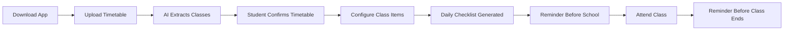
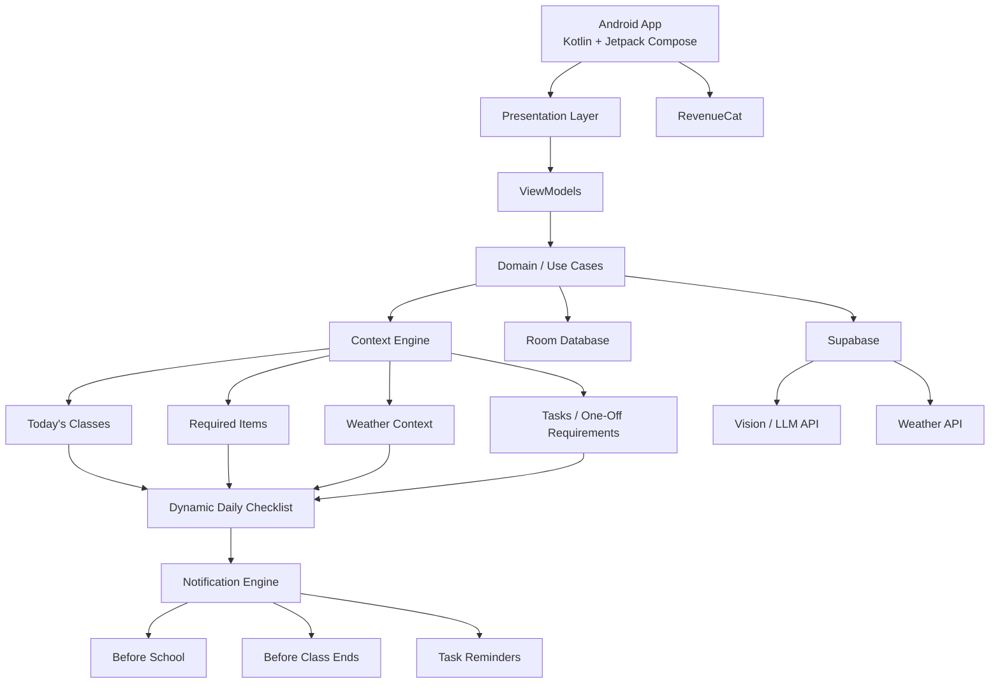
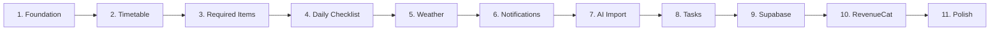

# 🎒 University Smart Checklist

> **Implementation update:** Follow [BUILD.md](BUILD.md) for the current C++/Kotlin architecture and [docs/SETUP.md](docs/SETUP.md) for build commands, configuration, cost controls and verified status. The architecture and roadmap below are the original concept and are superseded by BUILD.md.

> A context-aware Android checklist that automatically reminds university students what to bring, what to take home, and what needs to be completed based on their timetable, upcoming tasks, and real-world context.

## Problem

University students have different classes every day, and each class may require different items.

A student might need:

- Laptop for a programming lab
- Calculator for mathematics
- Lab card for a practical session
- Prototype for a project class
- Umbrella because rain is expected
- A reminder about tomorrow's quiz or submission

Traditional checklist apps are static. Students still need to remember **what they should put into the checklist in the first place**.

This project makes the checklist automatically adapt to the student's day.

---

# Core Idea

The student uploads their timetable once.

The app then knows:

```text
What classes they have today
        +
What each class normally requires
        +
One-off things needed for a specific lesson
        +
Upcoming quizzes / submissions
        +
Context such as weather
        ↓
Personalised daily checklist
```

The app also reminds students before a class ends so they do not leave their belongings behind.

---

# Example

A student's Monday timetable:

```text
10:00 – 12:00  Operating Systems Lab
14:00 – 16:00  Data Structures Tutorial
```

Configured requirements:

```text
OS Lab
├── Laptop
├── Charger
└── Lab Card

DSA Tutorial
├── Laptop
└── Calculator
```

Weather forecast:

```text
75% chance of rain
```

The app generates:

```text
MONDAY

Before you leave:

☐ Laptop
☐ Charger
☐ Lab Card
☐ Calculator
☐ Umbrella
   Rain expected later
```

At 3:50 PM:

```text
DSA ends in 10 minutes.

Before you leave:
• Laptop
• Charger
• Calculator
```

---

# User Flow



### First-time setup

1. Download the app.
2. Allow notifications.
3. Upload a timetable screenshot/PDF or enter classes manually.
4. AI extracts the modules, class times and locations.
5. Student confirms or edits the extracted timetable.
6. Student specifies what they normally need for each class.
7. The app begins generating daily checklists automatically.

The timetable only needs to be configured once unless the student's schedule changes.

---

# Different Students / Different Modules

Nothing is hardcoded to a particular university or module.

Each account owns its own:

```text
User
 └── Courses
      └── Class Sessions
           └── Required Items
```

Example:

### Student A

```text
CSD2183 — Data Structures
Monday 2 PM – 4 PM

CSD2101 — Computer Graphics
Wednesday 10 AM – 12 PM
```

### Student B

```text
MTH2001 — Calculus
Tuesday 9 AM – 11 AM

PHY1002 — Physics
Thursday 1 PM – 3 PM
```

Students can:

- Import their timetable
- Add classes manually
- Edit classes
- Delete classes
- Add their own modules
- Configure required items for every class

---

# Core Features

## 1. Timetable Import

Students can upload:

- Screenshot
- Image
- PDF

A multimodal model converts the timetable into structured class data.

```text
Timetable Image
      ↓
Vision / LLM
      ↓
Structured Classes
      ↓
Confirmation Screen
      ↓
Saved Timetable
```

AI output is **never saved without user confirmation**.

Manual timetable entry is always available.

---

## 2. Class-Specific Items

Students configure reusable requirements.

Example:

```text
Operating Systems Lab

Usually bring:
☑ Laptop
☑ Charger
☑ Lab Card
```

These items automatically appear whenever that class occurs.

---

## 3. Dynamic Daily Checklist

The checklist is generated from:

```text
Today's Classes
      +
Class Requirements
      +
One-Off Requirements
      +
Weather
      +
Relevant Tasks
      +
User Preferences
      ↓
Today's Checklist
```

Duplicate items are automatically merged.

---

## 4. Context-Aware Suggestions

External APIs can add relevant items automatically.

Initial MVP:

```text
Rain probability high
        ↓
Suggest umbrella
```

Future possibilities could include:

- High UV → sunscreen
- Hot weather → water bottle
- Class location / activity-specific requirements

Contextual suggestions should always explain why they were added.

Example:

```text
☐ Umbrella
  Rain expected around 3 PM
```

---

## 5. One-Off Class Requirements

Students can add something required only for a specific class/date.

Example:

```text
Bring Arduino

For:
Embedded Systems Lab

When:
Thursday
```

On Thursday:

```text
⚠ Arduino
Required for Embedded Systems Lab
```

After that session, it no longer appears automatically.

---

## 6. Quiz / Assignment / Submission Reminders

Students can add:

```text
Operating Systems Assignment

Due:
Friday 11:59 PM

Estimated work:
4 hours

Remind me:
Daily starting 3 days before
```

Supported reminder styles:

```text
Once
Daily
Every N days
X days before
Custom
```

The goal is not to replace a full task-management application.

Tasks exist primarily to prevent students from forgetting important academic requirements.

---

# Reminder System

There are three main reminder types.

## Before Leaving Home

The app does **not** attempt to magically detect when the student physically leaves home.

Instead, it calculates a reminder using:

```text
First Class Time
-
Typical Travel Time
-
Preparation Buffer
=
Reminder Time
```

Example:

```text
First class       10:00 AM
Travel time          45 min
Preparation          15 min

Reminder            9:00 AM
```

Users can configure this.

---

## Before Class Ends

Class end times already exist in the timetable.

Example:

```text
DSA Tutorial
2:00 PM – 4:00 PM
```

Default setting:

```text
Remind 10 minutes before class ends
```

Notification:

```text
3:50 PM

DSA is ending soon.

Don't forget:
• Laptop
• Charger
• Calculator
```

---

## Task / Submission Reminders

Students decide:

- When reminders start
- How frequently they occur
- Estimated time needed
- Deadline

Example:

```text
Quiz Friday

Estimated preparation:
2 hours

Reminder:
Every day starting Wednesday
```

---

# Architecture



---

# Technology Stack

## Android

```text
Language             Kotlin
UI                   Jetpack Compose
Architecture         MVVM
Dependency Injection Hilt
Local Database       Room
Preferences          DataStore
Background Work      WorkManager
Timed Notifications  AlarmManager where necessary
Networking           Retrofit + OkHttp
Serialization        Kotlinx Serialization
```

## Backend

```text
Supabase
├── Authentication
├── PostgreSQL
├── Storage
└── Edge Functions
```

## External Services

```text
Weather API
Vision / Multimodal LLM API
RevenueCat
```

---

# Engineering Principle

The system follows:

> **AI for interpretation. Rules for execution.**

Example:

```text
AI:
"This timetable contains an OS Lab on Monday at 10 AM."

↓

Rule Engine:
"OS Lab requires laptop + charger + lab card."

↓

Weather API:
"Rain probability is 80%."

↓

Rule:
Add umbrella.
```

The app should **not ask an LLM to invent the student's checklist every morning**.

This keeps the system:

- Predictable
- Reliable
- Fast
- Cheap
- Debuggable
- Partially functional offline

---

# Core Data Model

```text
User
│
├── Course
│    └── ClassSession
│          └── ClassRequiredItem
│
├── RequiredItem
│
├── OneOffRequirement
│
├── Task
│
├── ChecklistEntry
│
└── ReminderPreferences
```

### Course

```text
id
userId
courseCode
courseName
```

### ClassSession

```text
id
courseId
title
dayOfWeek
startTime
endTime
location
classType
```

Possible class types:

```text
LECTURE
TUTORIAL
LAB
PROJECT
OTHER
```

### RequiredItem

```text
id
name
category
icon
```

### OneOffRequirement

```text
id
classSessionId
date
itemName
notes
```

### Task

```text
id
courseId
title
description
dueDateTime
estimatedDurationMinutes
reminderFrequency
completed
```

---

# Context Engine

The main business-logic component is:

```text
GenerateDailyChecklistUseCase
```

Conceptually:

```text
GenerateDailyChecklist(date):

    classes = GetClassesForDate(date)

    checklist = []

    for each class:
        add class.requiredItems

    add oneOffRequirements(date)

    weather = getWeather(date)

    if rainProbability >= threshold:
        add umbrella

    add relevant task reminders

    remove duplicates

    return checklist
```

---

# Local-First Design

The application should remain useful without internet access.

```text
App Opens
    ↓
Read Room Database
    ↓
Immediately Display Schedule + Checklist
    ↓
Fetch Weather / Cloud Updates
    ↓
Update Context If Necessary
```

Internet failure must never prevent users from accessing:

- Their timetable
- Today's classes
- Required items
- Existing tasks
- Existing checklist

---

# Project Structure

```text
app/
│
├── navigation/
│
├── ui/
│   ├── onboarding/
│   ├── timetable/
│   ├── today/
│   ├── classes/
│   ├── tasks/
│   └── settings/
│
├── domain/
│   ├── model/
│   └── usecase/
│
├── data/
│   ├── local/
│   ├── remote/
│   └── repository/
│
├── notification/
│
├── billing/
│
└── di/
```

Expected flow:

```text
Compose UI
    ↓
ViewModel
    ↓
Use Case
    ↓
Repository
    ↓
Room / API
```

Business logic must not live directly inside Compose screens.

---

# MVP Screens

The first version should stay focused.

### 1. Welcome

```text
Stop forgetting things for class.

[ Get Started ]
```

### 2. Timetable Import

```text
Upload your timetable

[ Choose Image ]
[ Choose PDF ]
[ Enter Manually ]
```

### 3. Confirm Timetable

```text
MONDAY

10:00 OS Lab
14:00 DSA Tutorial

[ Edit ]
[ Looks Good ]
```

### 4. Today

```text
MONDAY

OS Lab — 10:00 AM
DSA Tutorial — 2:00 PM

Before you leave:

☐ Laptop
☐ Charger
☐ Lab Card
☐ Calculator
☐ Umbrella
   Rain expected later

[ + Add Item ]
```

### 5. Class Requirements

```text
OS Lab

Usually bring:

☑ Laptop
☑ Charger
☑ Lab Card

[ + Add Item ]
```

### 6. Add Requirement / Task

```text
Bring Prototype

For:
Project Class

Date:
Thursday

Reminder:
1 day before
```

---

# Build Roadmap



## Phase 1 — Foundation

- Create Kotlin/Compose project
- Navigation
- Hilt
- Room
- Core models

## Phase 2 — Timetable

- Manual class creation
- Timetable display
- Edit/delete classes
- Persist locally

## Phase 3 — Required Items

- Add items to classes
- Reuse items between classes
- Persist relationships

## Phase 4 — Daily Checklist

- Implement `GenerateDailyChecklistUseCase`
- Combine today's classes
- Merge requirements
- Deduplicate items

## Phase 5 — Weather

- Weather API integration
- Rain → umbrella rule

## Phase 6 — Notifications

- Before-school reminder
- Before-class-end reminder
- Task reminders

## Phase 7 — AI Timetable Import

```text
Screenshot / PDF
      ↓
Vision Model
      ↓
Structured JSON
      ↓
Confirmation
```

## Phase 8 — Tasks

- Assignments
- Quizzes
- One-off requirements
- Reminder frequency
- Estimated completion time

## Phase 9 — Supabase

- Authentication
- Cloud backup/sync

## Phase 10 — RevenueCat

- SDK integration
- Entitlements
- Purchase/restore flow

## Phase 11 — Polish

- Animations
- Error states
- Loading states
- Better onboarding
- Notification experience
- Final demo flow

---

# Shipaton Demo Flow

The demo should communicate the product in less than two minutes.

### 1.

Upload a university timetable.

### 2.

AI extracts:

```text
Monday
10:00 OS Lab
14:00 DSA Tutorial

Thursday
13:00 Project Class
```

### 3.

Show automatically configured class requirements.

### 4.

Open Monday.

App generates:

```text
Laptop
Charger
Lab Card
Calculator
```

### 5.

Weather reports rain.

App automatically adds:

```text
Umbrella
```

### 6.

Student adds:

```text
Bring prototype
Thursday Project Class
```

### 7.

Show Thursday checklist containing:

```text
⚠ Prototype
```

### 8.

Simulate class nearing completion.

Notification appears:

```text
DSA ends in 10 minutes.

Don't forget:
Laptop
Charger
Calculator
```

---

# RevenueCat

RevenueCat will be integrated into the app for Shipaton.

Potential free features:

- Daily checklist
- Timetable
- Basic reminders
- Weather suggestions

Potential premium features:

- Multiple timetable profiles
- Cloud synchronization
- Advanced reminder rules
- Additional context integrations
- Widgets / personalization

The core hackathon experience should remain accessible without requiring payment.

---

# Non-Goals for MVP

Do **not** add these until the core experience works:

- Social network
- Student messaging
- Attendance tracking
- University portal integrations
- Full calendar replacement
- AI chatbot
- Location tracking
- Complex recommendation ML
- Collaborative task management
- Microservices
- Custom weather prediction

---

# Development Rules

When developing this project with Codex/ChatGPT:

1. Implement one feature at a time.
2. Do not rewrite unrelated working code.
3. Compile after meaningful changes.
4. Resolve build errors before moving forward.
5. Keep Compose, business logic and persistence separate.
6. Do not silently remove requirements.
7. Prefer simple implementations over unnecessary abstractions.
8. Keep the project runnable at the end of every phase.
9. Treat this README as the product and architecture source of truth.
10. Ask before making architectural changes that conflict with this specification.

---

# Product Philosophy

Most productivity apps ask students to remember:

> **“What do I need to remember?”**

This app tries to remove that step.

```text
Your timetable
      +
Your classes
      +
Your requirements
      +
Your environment
      ↓
The right checklist
at the right time.
```

### One-sentence pitch

> **A university checklist that automatically knows what you need today based on your timetable, upcoming requirements and real-world context—and reminds you not to leave those things behind after class.**


For local Android emulator testing, start the backend on 127.0.0.1:8000
and build the Android app with:

gradlew.bat installDebug -PbackendUrl=http://10.0.2.2:8000

10.0.2.2 is the Android emulator alias for the host machine.